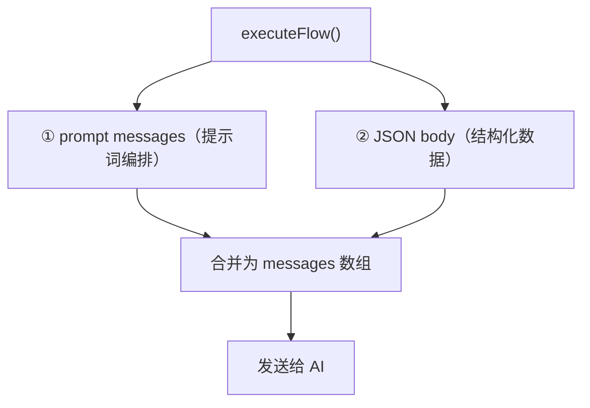
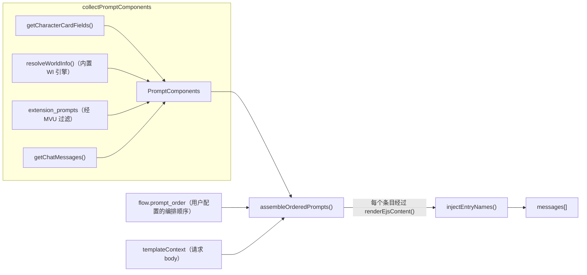

# EW 工作流请求构建全流程

## 概览

工作流 AI 收到的请求由 **两部分** 拼接而成：



## ① Prompt Messages（提示词编排路径）

**代码入口**: `dispatcher.ts` → `assembleOrderedPrompts()`



### 数据来源

| PromptComponent | 来源 | 说明 |
| --------------- | ---- | ---- |
| `main` | `getCharacterCardFields().system` | 主系统提示词 |
| `charDescription` | `getCharacterCardFields().description` | 角色描述 |
| `charPersonality` | `getCharacterCardFields().personality` | 角色性格 |
| `scenario` | `getCharacterCardFields().scenario` | 场景 |
| `personaDescription` | `getCharacterCardFields().persona` | 用户人设 |
| `dialogueExamples` | `getCharacterCardFields().mesExamples` | 对话示例 |
| `jailbreak` | `getCharacterCardFields().jailbreak` | 越狱提示 |
| `worldInfoBefore` | `resolveWorldInfo()` → before 桶 | 内置 WI 引擎解析（非 ST 预拼接） |
| `worldInfoAfter` | `resolveWorldInfo()` → after 桶 | 同上 |
| `chatMessages` | `getChatMessages()` | 最近 N 轮对话 |
| `depthInjections` | `extension_prompts (position=IN_CHAT)` | 扩展深度注入 |
| `beforePromptInjections` | `extension_prompts (position=BEFORE_PROMPT)` | 扩展前置注入 |
| `blockedWorldInfoContents` | `collectIgnoredWorldInfoContents()` | 被 MVU 过滤的条目内容（用于子串剥离） |

### 世界信息解析（内置 WI 引擎）

EW 不使用酒馆预拼接的 `worldInfoBefore/After` 文本，而是通过 `worldinfo-engine.ts` 自行解析：

1. **收集条目** — 从角色世界书（主 + 附加）、全局世界书、人设世界书、聊天世界书中收集所有条目
2. **过滤** — 跳过 MVU 条目（`mvu-compat.ts`）、特殊条目（`[GENERATE:]`、`[RENDER:]`、`@INJECT` 等）
3. **激活** — 复制 ST 的关键词匹配逻辑（常量条目、装饰器、主关键词、次关键词 AND/NOT 逻辑、概率过滤、互斥组）
4. **EJS 渲染** — 激活条目的内容经过 `evalEjsTemplate()` 执行（支持 `getwi()`、`getvar()` 等）
5. **Controller 展开** — 如果条目是 `EW/Controller`，其 getwi 拉取的 Dyn 条目会展开为独立的 WI 条目
6. **分桶** — 按 position 分为 before/after/atDepth 三个桶

### 扩展提示词处理

`extension_prompts` 来自酒馆其他插件的注入。EW 对其做以下处理：

1. **MVU 内容剥离** — `stripMvuPromptArtifacts()` 移除 MVU XML 块
2. **被忽略条目内容去重** — `stripBlockedPromptContents()` 子串匹配移除已过滤 WI 条目的内容
3. **MVU 内容检测** — `isLikelyMvuWorldInfoContent()` 整体检测是否为 MVU 产物，是则丢弃
4. **按 position 分类** — IN_PROMPT → worldInfoBefore；IN_CHAT → depthInjections；BEFORE_PROMPT → beforePromptInjections

### 组装过程

`assembleOrderedPrompts()` 遍历用户配置的 `prompt_order`：

1. 遇到 **marker**（如 `worldInfoBefore`）→ 从 PromptComponents 取内容
2. 遇到 **prompt**（用户自写内容）→ 使用 `entry.content`
3. **所有内容经过 `renderEjsContent(templateContext)`** → EJS 标签被执行 + `{{mustache}}` 宏替换
4. `chatHistory` 标记 → 展开为多条 user/assistant 消息
5. `injection_position='in_chat'` → 按 depth 插入聊天历史中
6. `beforePromptInjections` → prepend 到请求最前面

### 宏替换（substituteParams）

`renderEjsContent()` 内部先用 `substituteParams()` 做 `{{mustache}}` 宏替换：

| 宏 | 值来源 |
| -- | ------ |
| `{{user}}` | 用户名 |
| `{{char}}` | 角色名 |
| `{{persona}}` | 人设描述 |
| `{{lastUserMessage}}` / `{{userInput}}` | 当前工作流的用户输入（从 runtimeState 提取） |
| `{{newline}}` | `\n` |
| `{{任意路径}}` | 从 templateContext 深路径取值 |

### 条目名称注入

`assembleOrderedPrompts()` 返回后，`injectEntryNames()` 对 messages 做后处理：

1. 调用 `collectLatestSnapshots()`（`floor-binding.ts`）获取最新快照数据
2. 快照包含：`controller`（Controller 原始内容）和 `dyn_entries`（`{ name, content, enabled }`）
3. 构建匹配列表，**按 content 长度降序排列**（长内容优先匹配，避免短串误匹配）
4. 遍历 messages 数组，对每条消息做子串匹配
5. 匹配成功 → 在该内容前插入 `[条目名]\n`

### 最终追加

dispatcher 在 messages 末尾追加两条：

```
messages = [
  ...beforePromptInjections,                             // ← BEFORE_PROMPT 扩展提示词
  ...assembleOrderedPrompts() 的结果,                     // ← 用户配置的提示词编排
  ↓ injectEntryNames() 后处理                             // ← EW 条目内容前加上名称标签
  { role: 'system', content: LLM_WORKFLOW_SYSTEM_PROMPT }, // ← 硬编码的工作流指令
  { role: 'user',   content: JSON.stringify(body) },       // ← JSON body（下面详述）
]
```

## ② JSON Body（结构化数据路径）

**代码入口**: `context-builder.ts` → `buildFlowRequest()`

### 当前 JSON body 结构

```json
{
  "version": "ew-flow/v1",
  "request_id": "uuid",
  "chat_id": "聊天ID",
  "message_id": 123,
  "user_input": "用户输入的消息",
  "trigger": {
    "timing": "before_reply",
    "source": "tavern_helper_hook",
    "generation_type": "normal",
    "user_message_id": 122,
    "assistant_message_id": 123
  },
  "flow": {
    "id": "flow_id",
    "name": "流名称",
    "priority": 100,
    "timeout_ms": 300000,
    "generation_options": { "temperature": 1.2, "..." : "..." },
    "behavior_options": { "..." : "..." }
  },
  "context": {
    "turns": 8,
    "extract_rules": [],
    "exclude_rules": []
  },
  "worldbook": {
    "worldbook_name": "目标世界书名"
  },
  "serial_results": []
}
```

## AI 实际看到的完整内容

```
┌──────────────────────────────────────────────┐
│ [BEFORE_PROMPT 扩展提示词]                    │
├──────────────────────────────────────────────┤
│ messages[0]: { role: system }                │
│   ← prompt_order 第一个条目（如 main）        │
│   ← 经过 renderEjsContent(templateContext)   │
├──────────────────────────────────────────────┤
│ messages[1]: { role: system }                │
│   ← worldInfoBefore（内置 WI 引擎解析）       │
│   ← 经 injectEntryNames() 后处理：           │
│   ← [EW/Controller] 原始 EJS 代码            │
│   ← [EW/Dyn/角色心情] 渲染后内容              │
│   ← [EW/Dyn/NPC状态] 渲染后内容              │
├──────────────────────────────────────────────┤
│ messages[2..N]: 其他标记和用户自写 prompt      │
│   ← charDescription, scenario 等             │
│   ← 按 prompt_order 顺序排列                 │
├──────────────────────────────────────────────┤
│ messages[N+1..M]: chatHistory                │
│   ← 最近 context_turns 轮对话                │
│   ← user/assistant 交替                      │
│   ← depthInjections 按 depth 插入            │
├──────────────────────────────────────────────┤
│ messages[M+1]: { role: system }              │
│   ← LLM_WORKFLOW_SYSTEM_PROMPT               │
│   ← "你是 Evolution World 的工作流执行器…"   │
├──────────────────────────────────────────────┤
│ messages[M+2]: { role: user }                │
│   ← JSON.stringify(body)                     │
│   ← FlowRequestV1 JSON                      │
│   ← 包含 flow 配置、worldbook_name 等        │
└──────────────────────────────────────────────┘
```
