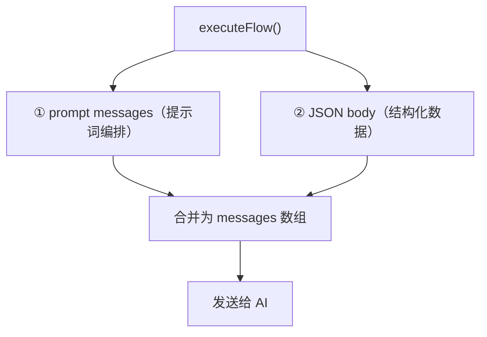
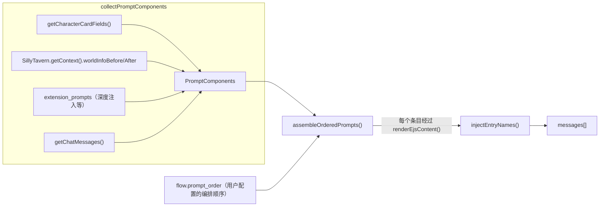

# EW 工作流请求构建全流程

## 概览

工作流 AI 收到的请求由 **两部分** 拼接而成：



## ① Prompt Messages（提示词编排路径）

**代码入口**: `dispatcher.ts` → `assembleOrderedPrompts()`



### 数据来源

| PromptComponent | 来源 | 说明 |
|----------------|------|------|
| `main` | `getCharacterCardFields().system` | 主系统提示词 |
| `charDescription` | `getCharacterCardFields().description` | 角色描述 |
| `charPersonality` | `getCharacterCardFields().personality` | 角色性格 |
| `scenario` | `getCharacterCardFields().scenario` | 场景 |
| `personaDescription` | `getCharacterCardFields().persona` | 用户人设 |
| `dialogueExamples` | `getCharacterCardFields().mesExamples` | 对话示例 |
| `jailbreak` | `getCharacterCardFields().jailbreak` | 越狱提示 |
| `worldInfoBefore` | `SillyTavern.getContext().worldInfoBefore` | ST 预拼接的世界信息文本 |
| `worldInfoAfter` | `SillyTavern.getContext().worldInfoAfter` | 同上 |
| `chatMessages` | `getChatMessages()` | 最近 N 轮对话 |
| `depthInjections` | `extension_prompts (position=IN_CHAT)` | 扩展深度注入 |
| `beforePromptInjections` | `extension_prompts (position=BEFORE_PROMPT)` | 扩展前置注入 |

### 组装过程

`assembleOrderedPrompts()` 遍历用户配置的 `prompt_order`：

1. 遇到 **marker**（如 `worldInfoBefore`）→ 从 PromptComponents 取内容
2. 遇到 **prompt**（用户自写内容）→ 使用 `entry.content`
3. **所有内容经过 `renderEjsContent()`** → EJS 标签被执行（`getvar()`、`getwi()` 等）
4. `chatHistory` 标记 → 展开为多条 user/assistant 消息
5. `injection_position='in_chat'` → 按 depth 插入聊天历史中

### 条目名称注入

`assembleOrderedPrompts()` 返回后，`injectEntryNames()` 对 messages 做后处理：

1. 调用 `collectLatestSnapshots()`（`floor-binding.ts`）获取最新快照数据
2. 快照包含：`controller`（Controller 原始内容）和 `dyn_entries`（`{ name, content, enabled }`）
3. 构建匹配列表，**按 content 长度降序排列**（长内容优先匹配，避免短串误匹配）
4. 遍历 messages 数组，对每条消息做子串匹配
5. 匹配成功 → 在该内容前插入 `[条目名]\n`

示例效果：
```
匹配前:                         匹配后:
角色当前心情很好...              [EW/Dyn/角色心情]
NPC小明在村口...                角色当前心情很好...
                               [EW/Dyn/NPC状态]
                               NPC小明在村口...
```

> [!NOTE]
> 快照中的 content 是 Dyn 条目的原始纯文本（AI 写入的），与 prompt 内经过 EJS 渲染后的内容一致，因此子串匹配可以成功。Controller 条目名来自 `settings.controller_entry_name`（默认 `EW/Controller`）。

### 最终追加

dispatcher 在 messages 末尾追加两条：

```
messages = [
  ...assembleOrderedPrompts() 的结果,    // ← 用户配置的提示词编排
  ↓ injectEntryNames() 后处理           // ← EW 条目内容前加上名称标签
  { role: 'system', content: LLM_WORKFLOW_SYSTEM_PROMPT },  // ← 硬编码的工作流指令
  { role: 'user',   content: JSON.stringify(body) },         // ← JSON body（下面详述）
]
```

## ② JSON Body（结构化数据路径）

**代码入口**: `context-builder.ts` → `buildFlowRequest()`

### 当前 JSON body 结构

```json
{
  "version": "ew-flow/v1",
  "request_id": "uuid",
  "chat_id": "聊天ID",
  "message_id": 123,
  "flow": {
    "id": "flow_id",
    "name": "流名称",
    "priority": 100,
    "timeout_ms": 8000,
    "generation_options": { "temperature": 1.2, "..." : "..." },
    "behavior_options": { "..." : "..." }
  },
  "context": {
    "turns": 8,
    "extract_rules": [],
    "exclude_rules": []
  },
  "worldbook": {
    "worldbook_name": "目标世界书名"
  },
  "serial_results": []
}
```

`worldbook_name` 来自 `resolveTargetWorldbook().worldbook_name`。

## AI 实际看到的完整内容

```
┌─────────────────────────────────────────────┐
│ messages[0]: { role: system }               │
│   ← prompt_order 第一个条目（如 main）       │
│   ← 内容经过 renderEjsContent()             │
├─────────────────────────────────────────────┤
│ messages[1]: { role: system }               │
│   ← worldInfoBefore                         │
│   ← 经 injectEntryNames() 处理后：          │
│   ← [EW/Controller]                        │
│   ← [EW/Dyn/角色心情] 内容...              │
│   ← [EW/Dyn/NPC状态] 内容...              │
├─────────────────────────────────────────────┤
│ messages[2..N]: 其他标记和用户自写 prompt     │
│   ← charDescription, scenario 等            │
│   ← 按 prompt_order 顺序排列                │
├─────────────────────────────────────────────┤
│ messages[N+1..M]: chatHistory               │
│   ← 最近 context_turns 轮对话               │
│   ← user/assistant 交替                     │
├─────────────────────────────────────────────┤
│ messages[M+1]: { role: system }             │
│   ← LLM_WORKFLOW_SYSTEM_PROMPT              │
│   ← "你是 Evolution World 的工作流执行器…"  │
├─────────────────────────────────────────────┤
│ messages[M+2]: { role: user }               │
│   ← JSON.stringify(body)                    │
│   ← FlowRequestV1 JSON                     │
│   ← 包含 flow 配置、worldbook_name 等       │
└─────────────────────────────────────────────┘
```
